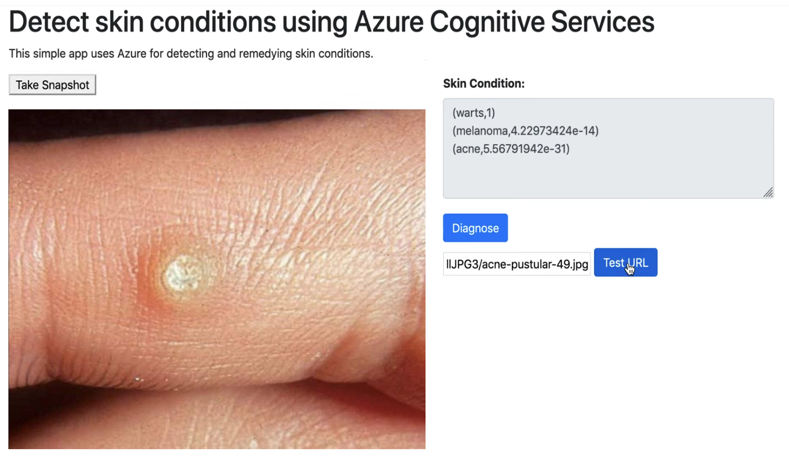

# Skin Scanner

Skin Scanner is a Python Flask app on Azure App Service on Linux that lets you send images of skin diseases to a model trained on classifying skin diseases. The model is built on Custom Vision and uses images from [Dermnet](http://www.dermnet.com/).

### Prerequisites

- Flask 
- Azure subscription (you can sign up for the free trial)

### Training the Model

1. Scrape a website for training images. For this app, we used Dermanet. Save the images locally.
2. Sign up for Custom Vision Prediction and Training resources
3. Navigate to the resource and add your images by label
4. Train the model and test in predictions
5. Publish the model

### Running the project

1. Grab the Prediction API keys and endpoints 
2. Add to your `.env` file or add to your `.bash_profile` with `export` and then source the file 
3. Make sure the alias corresponds with the aliases in `detector.py`
4. Run `flask run` 
5. Navigate to `127.0.0.1:5000` 

### Deploying

1. Sign up for Azure App Service
2. Run `az webapp up`
